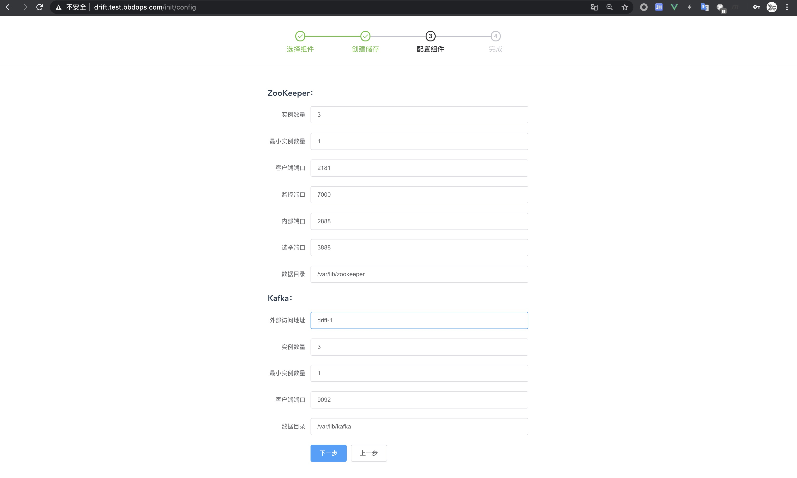

# Drift

> 目标是做一个 Kubernetes 之上的 "CDH"
>
> 实际上是一个 Kubernetes Operator
>
> 可以通过界面部署和管理大数据组件
>
> 支持持久化储存
>
> 支持外部访问

## 支持的组件

- [x] ZooKeeper 3.6.1
- [x] Kafka 2.5.0
- [ ] Yarn
- [ ] HDFS
- [ ] HBase
- [ ] Hive
- [ ] Spark
- [ ] Flink

## Getting Start

前提是有一个 Kubernetes 集群，并且集群中安装有 Ingress Controller。

第一步，创建命名空间：
```bash
kubectl create ns drift
```

第二步，使用 helm 部署 Drift：
```bash
git clone https://github.com/xujiyou-drift/drift-helm-chart.git
cd drift-helm-chart
helm install my-drift ./drift \
 --namespace drift \
 --set ingress.host=drift.test.bbdops.com
```

等待 Pod 创建完成：
```bash
kubectl get pods -n drift --watch
```

第三步，配置 hosts 或 dns，比如我这里在本机配置 hosts：
```
10.28.109.30 drift.test.bbdops.com
```

第四步，等几分钟之后，浏览器打开界面：http://drift.test.bbdops.com ，用户名及密码为 admin/admin


第五步，输入各组件所在的命名空间，和要选择的组件，目前仅支持 ZooKeeper 和 Kafka，ZooKeeper 是必须的：


第六步，数据储存类和卷大小，如果集群没有配置储存类，也可以选择跳过：


第七步，配置组件，Kafka 的外部访问地址需要填写，可以填写宿主机主机名，我这里主机名为 drift-1：



第八步，点击完成：


等待 Pod 创建完成：


或者使用命令观察 Pod 创建过程：
```bash
kubectl get pods -n bigdata --watch
```

由于 Kafka 依赖 ZooKeeper ，所以 Kafka 会自动重启几次。

创建完成如下图所示：


在界面上的效果如下图：


## 内部测试

在 k8s 集群内部测试 ZooKeeper 集群和 Kafka 集群，先来测试 ZooKeeper：

```bash
kubectl -n bigdata exec -i  -t zookeeper-cluster-0 -- bash
zkServer.sh status
zkCli.sh
```

测试Kafka，注意，kafka 在 ZooKeeper 中使用的路径不是默认的 / ，而是 /kafka ：

```bash
kubectl -n bigdata exec -i  -t kafka-cluster-0 -- bash
kafka-topics.sh --zookeeper zookeeper-cluster-0.zookeeper-cluster-headless-service:2181/kafka --create --topic one --replication-factor 3 --partitions 3
```

kafka 生产者：
```bash
kubectl -n bigdata exec -i  -t kafka-cluster-0 -- bash
kafka-console-producer.sh --bootstrap-server kafka-cluster-0.kafka-cluster-headless-service:9092,kafka-cluster-1.kafka-cluster-headless-service:9092,kafka-cluster-2.kafka-cluster-headless-service:9092 --topic one
```

kafka 消费者：
```bash
kubectl -n bigdata exec -i  -t kafka-cluster-1 -- bash
kafka-console-consumer.sh --bootstrap-server kafka-cluster-0.kafka-cluster-headless-service:9092,kafka-cluster-1.kafka-cluster-headless-service:9092,kafka-cluster-2.kafka-cluster-headless-service:9092 --topic one --from-beginning
```

在生产者的命令行里随便几条数据，会在消费者的命令行里看到数据打印

## 外部测试

在集群外部，可以使用 Java 或其他语言的库进行连接，为了方便，可以下载官方的二进制包，使用其中的客户端工具进行测试。

外部测试 ZooKeeper，端口映射：
```bash
kubectl port-forward zookeeper-cluster-0 -n bigdata 32181:2181 --address 0.0.0.0
```

测试 ZooKeeper：
```bash
zkCli.sh -server drift-1:32181
```

在外部连接 Kafka 需要专门设置，在上面已经设置了外部可访问的地址，可以查看 Kafka 对外开放的 service：
```bash
kubectl get svc -n bigdata 
```
这里为每一个 Kafka 的 Pod 都绑定了一个一一对应的 Service。

测试外部连接Kafka：
```bash
kafka-console-producer.sh --bootstrap-server drift-1:31090,drift-1:31091,drift-1:31092 --topic one
kafka-console-consumer.sh --bootstrap-server drift-1:31090,drift-1:31091,drift-1:31092 --topic one --from-beginning
```


## 使用的镜像

使用到的镜像都是定制的镜像，不可以使用其他人做的镜像。
构建镜像的代码在：https://github.com/xujiyou-drift/drift-images

## 前端

前端使用 Vue.JS 构建，代码在：https://github.com/xujiyou-drift/drift-vue

## 卸载

删除大数据组件：

```bash
kubectl delete ZooKeeper zookeeper-cluster -n bigdata
kubectl delete Kafka kafka-cluster -n bigdata
```

再删除 Drift
```bash
helm uninstall my-drift ./drift --namespace drift
```